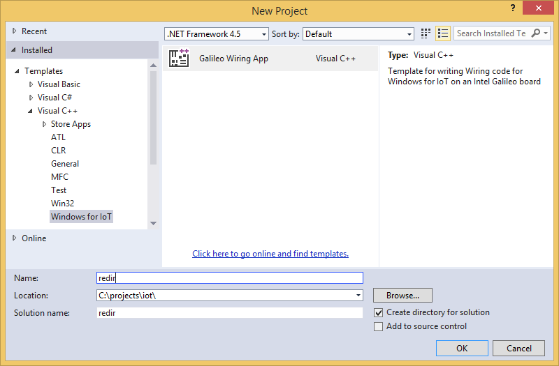
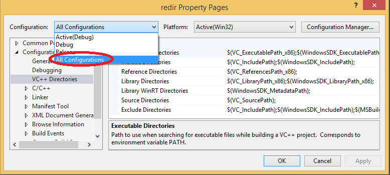
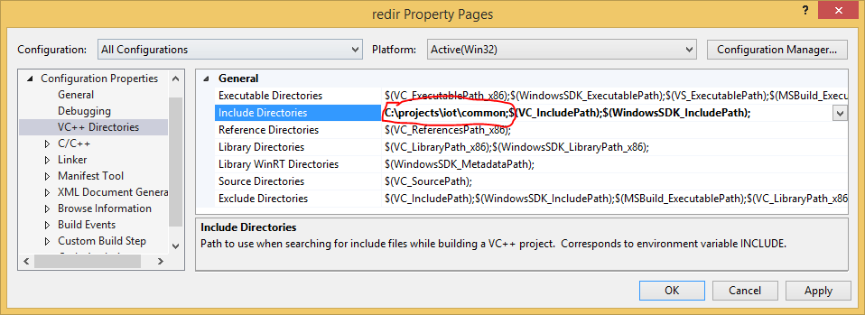
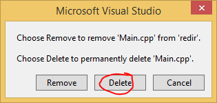
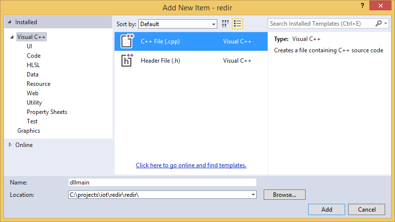
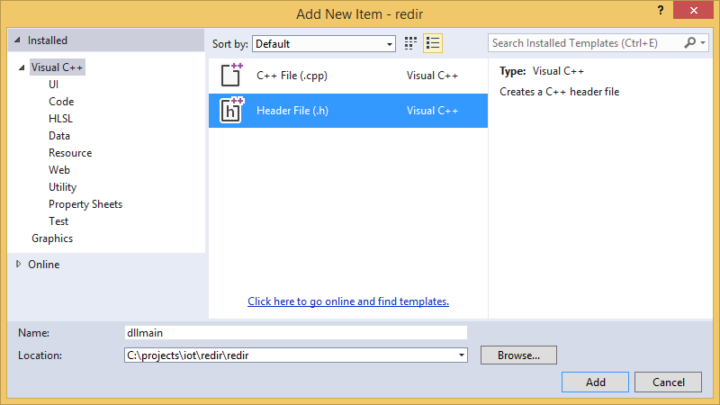
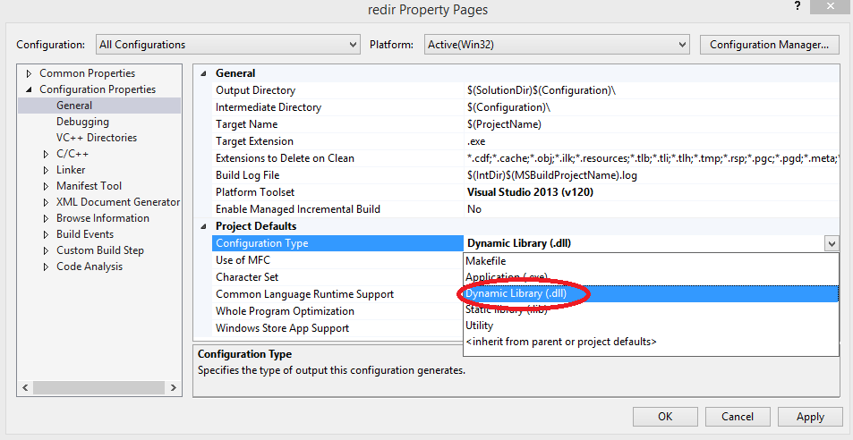
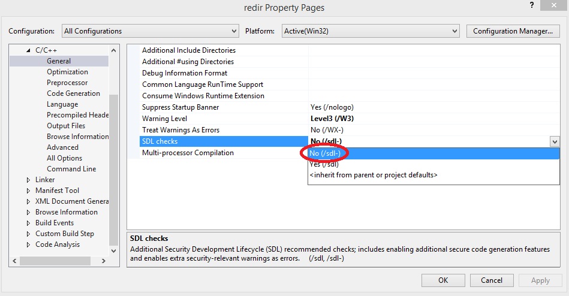
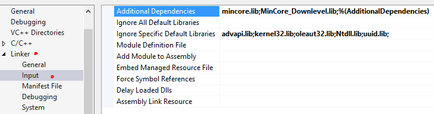
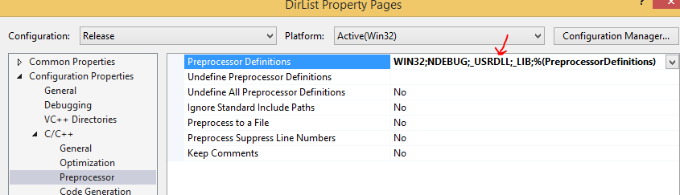

.. _atl-server-projects:

creating an atl server request handler
======================================

This example will show you how to create an ATL Server web application from the Microsoft.IoT.Galileo.Arduino Nuget package. You can also download the package (.msi) for Visual Studio 2013 from http://windowsondevices.com/

Creating the Visual Studio Project
----------------------------------

1. Open up Visual Studio and create a new project

2. Right click the project and click properties, drill down to VC++ directories

3. Select All Configurations

4. insert C:\\projects\\iot\\common; at the beginning of the list of include directories as shown below

For more information about this, please refere to the document that shows you how to modify the atl and atl server include files

5. Remove Main.cpp from the project and delete it

6. Right click the project and add a new .cpp file and call it dllmain

7. Right click the project and add a new .h file and call it dllmain

8. Right click the project and change the output to dynamic link library as shown below

9. Also disable the SDL checkes as shown below

10. You should also change the libraries as shown below

11. Also add the _USRDLL; instead of the CONSOLE

Modifying the atl and atl server include files
----------------------------------------------

Line numbers are consecutive after each modification

1. Download the atl server files from https://bintray.com/artifact/download/rbeckett37/generic/common.zip

2. Extract it to a directory (ie. C:\\projects\\iot\\common)

4. Run the batch script which copies 3 files from visual studio to the c:\\projects\\iot\\common directory , namely atlutil.h, atlbase.h and atlcomcli.h

5. Comment out lines in those 3 files as shown 

#### atlutil.h ####

.. code-block:: c++

   line 34 //#include <atlpath.h>

#### atlcomcli.h ####

.. code-block:: c++

   line 130 - 146: /*_Check_return_ inline HRESULT AtlSetChildSite(
    	_Inout_ IUnknown* punkChild,
    	_Inout_opt_ IUnknown* punkParent)
    {
    	(...)
    	return hr;
    }*/

.. code-block:: c++

   line 3028 - 3033:
    /*hr = punkVal->QueryInterface(__uuidof(IPersistStreamInit), (void**)&spStream);
    if (FAILED(hr))
    {
    	spStream.Detach();
    	return hr;
    }*/

.. code-block:: c++

    line 3227 - 3229, 3231:
    //hr = punkVal->QueryInterface(__uuidof(IPersistStreamInit), (void**)&spStream);
    //if (FAILED(hr))
    //{
    break; // do not comment out break;
    //}

#### atlbase.h ####

.. code-block:: c++

   line 206 - 219:
    /*HRESULT WINAPI RegisterClassObject(
    _In_ DWORD dwClsContext,
    _In_ DWORD dwFlags)
    {
    	(...)
    }*/

.. code-block:: c++

   line 7205 - 7336: 
	/*ATLINLINE ATLAPI AtlRegisterClassCategoriesHelper
    {
		(...)
    	return(S_OK);
	}*/

After you've finished editing these files, you should end up with a directory of modified atl and atl server files.

.. toctree::
   :maxdepth: 2

    atl-server-projects
    building

