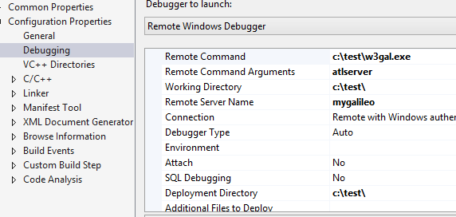

.. _debugging:

debugging
=========

Use this procedure for debugging your atl server request handlers:

1. Download the debug build of w3gal.exe from https://dl.bintray.com/artifact/download/rbeckett37/generic/debug/w3gal.exe - 456KB

2. In your web applications' remote debugging property page, specify the following options:

3. Set your breakpoints and hit F5 (even though VS tells you the breakpoint won't be hit, after hitting F5 you will hit the breakpoint).

View the ShowMe sample for example debugging information already pre-populated into a project.

.. toctree::
   :maxdepth: 2

    debugging
