.. _ssl:

Importing the certificate to w3gal
==================================

Downloads
---------

https://bintray.com/artifact/download/rbeckett37/generic/util/ImportPFX.exe  - 26KB

https://bintray.com/artifact/download/rbeckett37/generic/util/HttpSetCert.exe - 20KB

1. Copy the .pfx file to the galileo
2. Open a telnet session to the mygalileo and run ImportPfx
3. Next run HttpSetCert
4. Specify /s when running w3gal and you are now running a secure webserver.

To remove certificates that you have installed:

1. certmgr -del -c -n mygalileo -s -r LocalMachine My
2. certmgr -del -c -n mydomain-CA -s -r LocalMachine Root

Troubleshooting
---------------

Q. After setting up the certificate and starting w3gal.exe, I am unable to connect to the webserver remotely.

A. Try connecting via IP Address instead of hostname. If necessary, configure your DNS or hosts file. Also try inputting the FQDN instead of just a hostname.

Setup an Enterprise-CA
----------------------

1. Install a windows 2012 r2 server with active directory, dhcp, dns and a certificate authority.
2. Open up certificate authority management console and right click the certificate authority and choose properties
3. Click the Extensions tab
4. Select the http entry and check the 2 checkboxes as shown below

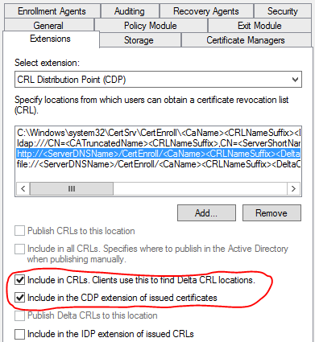

5. select AIA from the drop down listbox and then select the http entry and check the box as shown below

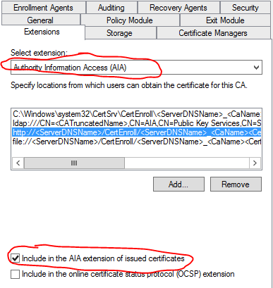

6. Now you will need to duplicate the WebServer template. In the certificate authority management console, right click the certificate templates folder and choose **Manage**

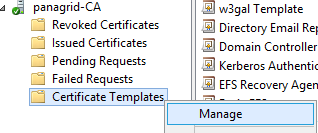

7. Right click the WebServer template and choose duplicate

8. For the compatibility , select Windows Server 2012 R2 for the authority and Windows 8 for the client

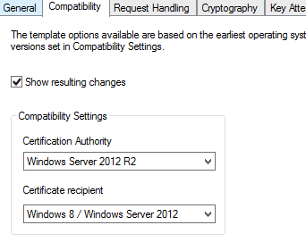

9. Check Allow private key to be exported under the request handling tab

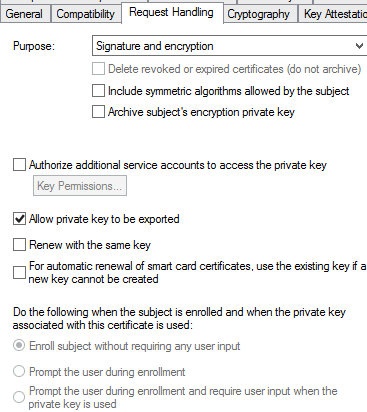

10. Click OK and close the certificate templates console

11. Now you will need to move the duplicated WebServer template you created into production. In the certificate authority management console, right click the certificate templates folder and choose New-> **Certificate Template to Issue**

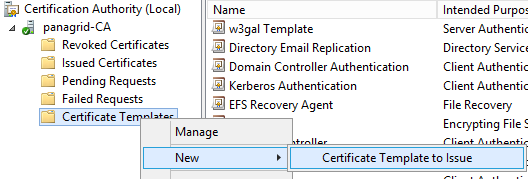

12. Issue the template you created earlier

13. Open an administrative command prompt and type mmc and press enter

14. Go to File Menu -> and select Add/Remove Snap-In

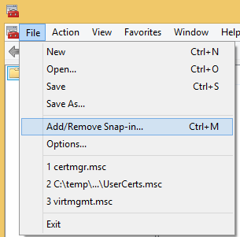

15. Select certificates, choose Add

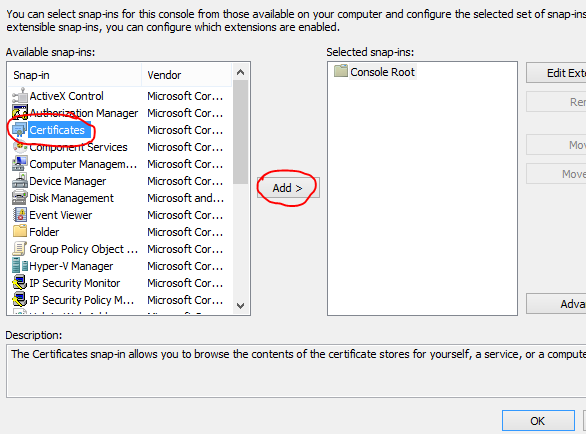

16. Choose computer, next

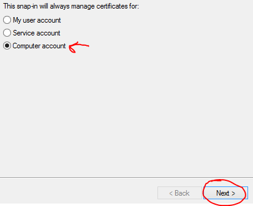

17. Click Finish and OK

18. Right click the Certificates->Personal-> **Certificates** and select All Tasks->Advanced Operations-> **Create Custom Request** from the fly-out menus

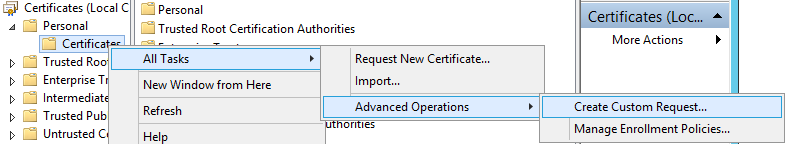

19. Click Next, Next and then choose the template you created earlier

20.Click the down arrow and then click Properties

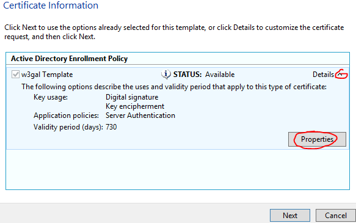

21. Enter your server's FQDN for the common name and click add. Also add a dns name as shown below

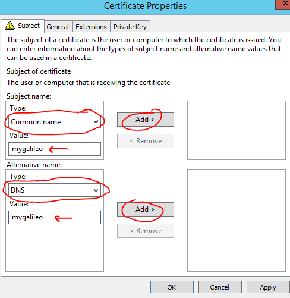

22. click the Private Key tab and allow the private key to be exported

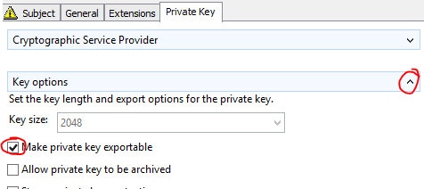

23. expand the Key permissions section and add localcomputer\everyone access to the private key click ok and save it to the hard drive

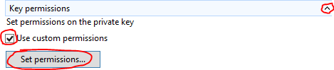

24. open up the certification authority management console, right click the CA and choose **submit new request**

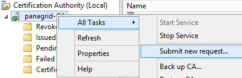

25. Point it to the ssl.req file you created in the step before the previous and click Open

26. Afterwards, open the certificate that gets created in Windows Explorer by double clicking on it

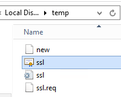

27. Install it into the Local Machine

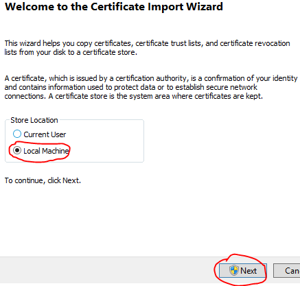

28. Click Next and then Finish

29. A successful import will result in a certificate being placed in the Local System's MY store. The certificate's issued by must be different than the issued to.

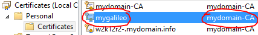

31. Click Next then Choose Yes, export the private key

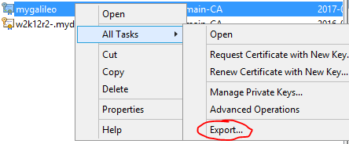

32. Choose Next

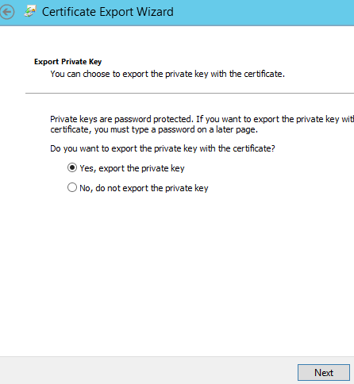

33. Enter a password twice and choose next

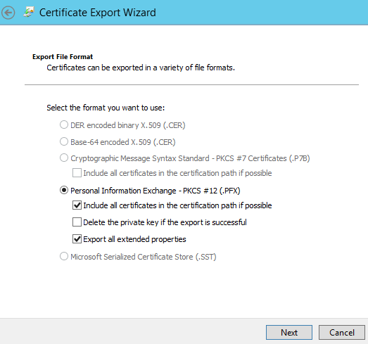

34. Save the file to the local hard disk. The private key is confidential, so after you have finished transporting it to the destination, delete the file and zero out your hard disk by using cipher /w 

35. You are now done with generating a certificate for w3gal.

.. toctree::
   :maxdepth: 2
    
    Downloads
    Troubleshooting
    Setup an Enterprise-CA
